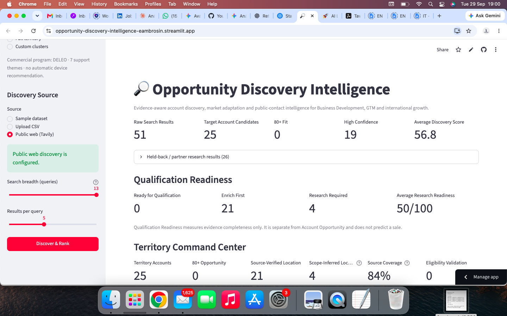
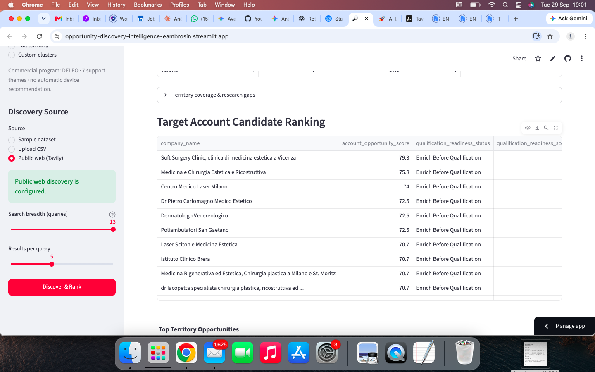
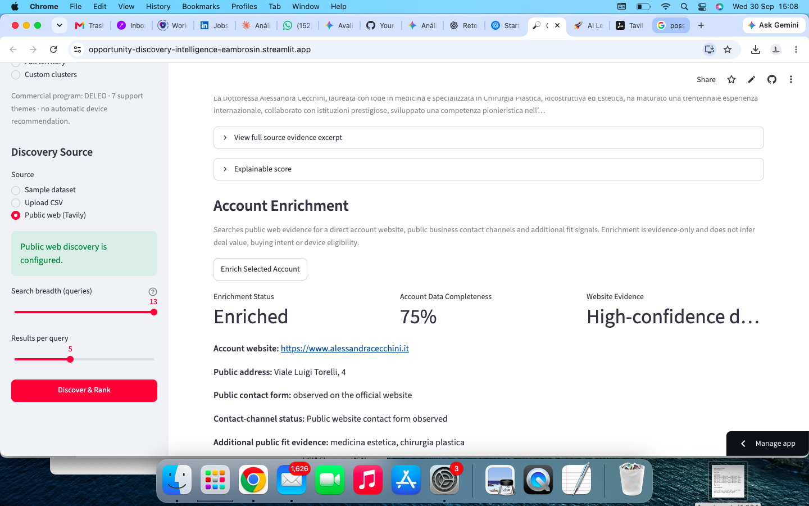
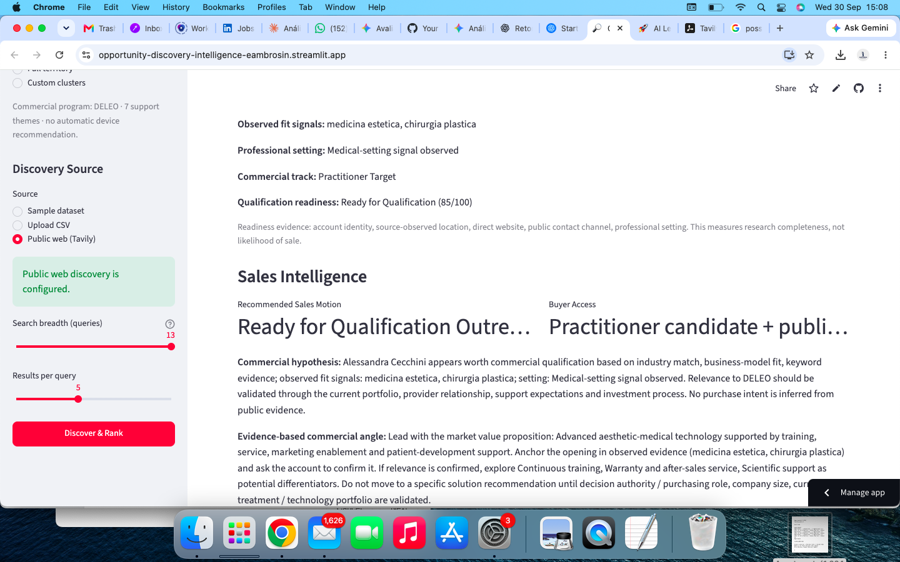

# Opportunity Discovery Intelligence

### Evidence-Aware Target Account Discovery | Public-Web Enrichment | Qualification Handoff

[](https://opportunity-discovery-intelligence-eambrosin.streamlit.app/)


[](https://github.com/Eambrosin/opportunity-discovery-intelligence/actions/workflows/ci.yml)

A practical Commercial Intelligence application for discovering target accounts, preserving public evidence, separating **opportunity attractiveness** from **research completeness**, validating public contacts and handing qualification context downstream.

> **Commercial logic first. Public evidence remains traceable. Unknown information stays unknown until validated.**

**[Launch the live application](https://opportunity-discovery-intelligence-eambrosin.streamlit.app/)**

---

## Business Problem

Market discovery often produces a noisy list of search results rather than a usable commercial queue.

Typical problems include:

- directories, editorial pages and vendors mixed with real target accounts
- incomplete or inferred location data presented as fact
- attractive accounts treated as qualification-ready before enough evidence exists
- homonyms or weak LinkedIn matches entering outreach
- research context lost when an account moves downstream

Opportunity Discovery Intelligence turns that research into an explainable workflow.

---

## Commercial Workflow

```text
TARGET MARKET PROFILE
        ↓
PUBLIC-WEB DISCOVERY
        ↓
TARGET ACCOUNT CANDIDATES
        ↓
ACCOUNT OPPORTUNITY
        +
QUALIFICATION READINESS
        ↓
ACCOUNT ENRICHMENT
        ↓
PUBLIC CONTACT VALIDATION
        ↓
SALES INTELLIGENCE
        ↓
ENGAGE HANDOFF v2
```

The system deliberately keeps different questions separate:

- **Account Opportunity:** How attractive does this account appear from observed evidence?
- **Qualification Readiness:** How complete is the evidence needed for a useful commercial conversation?
- **Buyer Access:** Is there a usable public contact path?
- **Sales Motion:** What should happen next?

A high-opportunity account is not automatically treated as a buying account.

---

## Product Preview

### 1. Discovery Executive Summary



Raw search volume is separated into target-account candidates and held-back research results, with Qualification Readiness and territory context visible from the start.

### 2. Target Account Ranking



Account candidates are ranked with explainable opportunity logic while directories, vendors and research-only results stay outside the commercial shortlist.

### 3. Account Enrichment & Qualification



The selected account is enriched with direct-website and public-contact evidence while research completeness remains separate from account attractiveness.

### 4. Sales Intelligence & Qualification Context



The workflow converts observed evidence into Sales Motion, Buyer Access, qualification questions, evidence gaps and next-best action without inferring purchase intent.

---

## Core Capabilities

- configurable target-market profiles
- Public Web / Tavily discovery
- explainable Discovery and Account Opportunity scoring
- target-account vs research/partner segregation
- territory and location evidence handling
- Qualification Readiness scoring
- selective Account Enrichment
- direct website and public-contact evidence
- sector-specific operational / technology evidence tracking
- public LinkedIn person-profile validation
- homonym filtering using identity + role + location
- deterministic Sales Intelligence
- qualification questions and evidence gaps
- ENGAGE Handoff v2
- optional evidence-aware AI brief
- automated test suite and GitHub Actions CI

---

## Evidence-Aware Design

The application distinguishes between:

**Observed fact**  
Supported by the current evidence set.

**Commercial interpretation**  
A deterministic conclusion based on observed inputs.

**Hypothesis / question**  
Potentially relevant but still requiring validation.

**Unknown**  
Information that should not be silently converted into a score or claim.

This is especially important for company size, buying intent, energy consumption, installed equipment, decision authority and technical eligibility.

---

## Sector Demonstrations

The same discovery engine can be configured for different commercial motions without changing its evidence-aware design.

### 1. Fotovoltaico — Aziende ad Alto Consumo Energetico

The default preset now focuses on **commercial and industrial end customers** that may have a strong economic case for on-site photovoltaic generation.

Typical target categories include:

- industrial and manufacturing plants
- food & beverage production
- cold storage and refrigeration
- logistics centers and warehouses
- supermarkets / GDO
- hotels and resorts
- private hospitals and healthcare facilities
- data centers
- paper, ceramic, glass, metals, foundries, chemicals and plastics
- agro-industrial operations and greenhouses

The objective is to discover **potential photovoltaic buyers**, not photovoltaic suppliers.

Installers, photovoltaic distributors, wholesalers and EPC providers are explicitly treated as non-target signals for this preset.

Public operational evidence such as production facilities, refrigeration, industrial processes, warehouses or other energy-intensive activities can increase commercial relevance. However, the application does **not** claim verified energy consumption.

Actual electricity load, load profile, roof / land availability, self-consumption potential, technical feasibility and investment timing remain qualification questions.

Possible account states include:

- **C&I Energy Consumer Target** — public operational signals support deeper commercial qualification
- **Potential C&I Energy Consumer — Validate Load** — company identity is usable, but energy demand and photovoltaic feasibility remain unverified

### 2. Medicina Estetica

A second preset supports opportunity discovery in the Italian **Medicina Estetica** market.

It includes localized search archetypes, practitioner / clinic classification, public-contact discovery and, where relevant, territory intelligence for Northern Italy.

The default commercial program is generic. Any vendor-specific context must be selected explicitly and is treated as an optional commercial-planning layer rather than as the identity of the application.

The generic engine is not limited to photovoltaic or medical-aesthetics use cases.

---

## IDENTIFY → ENGAGE

After public-contact validation, the application exports an **ENGAGE Handoff v2** containing:

- account and contact identity
- public LinkedIn profile candidate
- Account Opportunity
- Qualification Readiness
- Sales Motion
- Buyer Access status
- commercial hypothesis
- evidence-based commercial angle
- next best action
- qualification questions
- evidence gaps and validation flags
- account website/contact evidence
- territory and technology context

The objective is to avoid repeating research downstream while keeping uncertainty explicit.

---

## Demo Flow

A concise portfolio demonstration:

1. configure the target market
2. run Discover & Rank
3. inspect held-back vs target-account results
4. open the **Account Intelligence Workspace**
5. enrich the selected account
6. validate a public LinkedIn contact
7. review Sales Intelligence
8. export **ENGAGE Handoff v2**
9. open ENGAGE and generate qualification-first outreach

Full walkthrough: [docs/PORTFOLIO_DEMO.md](docs/PORTFOLIO_DEMO.md)

---

## Architecture

```text
app.py
  ↓
discovery_engine.py / web_discovery.py
  ↓
territory_intelligence.py
  ↓
account_enrichment.py
  ↓
contact_discovery.py
  ↓
sales_intelligence.py
  ↓
ENGAGE handoff
```

The deterministic decision logic is separated from presentation and optional AI assistance.

---

## Testing

The repository includes automated tests covering discovery, enrichment, evidence snapshots, contact discovery, territory intelligence, presets and Sales Intelligence.

```bash
python -m pytest -q
```

GitHub Actions runs syntax/import checks and the test suite on pushes and pull requests to `main`.

---

## Running Locally

```bash
git clone https://github.com/Eambrosin/opportunity-discovery-intelligence.git
cd opportunity-discovery-intelligence
pip install -r requirements.txt
streamlit run app.py
```

Public-web discovery requires a Tavily API key. Optional AI evidence briefs require an OpenAI API key.

Secrets should be supplied through environment variables or Streamlit secrets and are excluded from version control.

---

## Current Version

**v1.0.0 — Evidence-Aware Opportunity Discovery Intelligence**

This is the first stable portfolio release, covering public-web discovery, account ranking, Qualification Readiness, enrichment, public-contact validation, Sales Intelligence and ENGAGE Handoff v2. The main branch also includes post-release preset refinements for photovoltaic C&I end-customer discovery and Medicina Estetica.

[Release Notes](docs/RELEASE_NOTES_v1.0.0.md)

---

## Documentation

- [Portfolio Demo Walkthrough](docs/PORTFOLIO_DEMO.md)
- [Detailed Technical Reference](docs/TECHNICAL_REFERENCE.md)
- [v1.0.0 Release Notes](docs/RELEASE_NOTES_v1.0.0.md)

---

## Limitations

This is a portfolio and commercial decision-support application, not a production CRM or autonomous sales system.

Current boundaries include:

- no automated outreach sending
- no private-page scraping
- no claim that a public profile is a verified purchasing decision-maker
- no inferred buying intent
- no guarantee that indexed public contact details are current
- human review remains required before commercial use

---

## Portfolio Context

This project is the **IDENTIFY** layer of the broader Commercial Intelligence portfolio:

```text
IDENTIFY → PRIORITIZE → ENGAGE
IDENTIFY / Partner Universe → PARTNER → ENGAGE
```

**Portfolio:** [github.com/Eambrosin](https://github.com/Eambrosin)

---

## Author

**Eduardo Ambrosin**  
International Business Development | Strategic Partnerships | GTM | Commercial Intelligence
